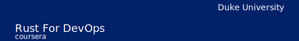

# 

# Continuous Integration and Continuous Delivery with Rust

_Rust for DevOps week 3: CI/CD with Rust_

This week, you will learn how to implement continuous integration and continuous delivery pipelines using tools like GitHub Actions and Jenkins. You will understand core CI/CD concepts, components of a pipeline, and workflows for automating builds, tests, and deployments. By managing dependencies between jobs, implementing logic, and linting artifacts, you will create robust pipelines tailored to your project needs. You will apply these skills to build an automated CI/CD pipeline for a sample application.

This is week 4 (the last!) of the [Rust For DevOps](https://insight.paiml.com/prr?utm_source=GitHub "Coursera Course") course. There are 4 weeks in total:

- [week 1](https://github.com/alfredodeza/rust-setup) 
- [week 2](https://github.com/alfredodeza/rust-monitoring-logging)
- [week 3](https://github.com/alfredodeza/rust-systems-programming/) 
- [week 4](https://github.com/alfredodeza/advanced-ci-cd-concepts) 👈 You are here!

## Example project: CI/CD for a Microservice

You will use this example microservice to explore how to apply CI/CD and automation best-practices to an existing Rust project. Although some of the technologies used are related to Rust, these concepts can be applied to other types of projects as well.

## Resources

- [Rust Book](https://doc.rust-lang.org/book/)
- [First steps with Rust Learning Path](https://learn.microsoft.com/training/paths/rust-first-steps/?WT.mc_id=academic-0000-alfredodeza)
- [DevOps command-line tools in Python and Rust](https://learning.oreilly.com/videos/devops-command-line-tools/28037639VIDEOPAIML/)

**Coursera Courses**

- [MLOps Machine Learning Operations Specialization](https://www.coursera.org/specializations/mlops-machine-learning-duke)
- [Linux and Bash for Data Engineering](https://www.coursera.org/learn/linux-and-bash-for-data-engineering-duke)
- [Open Source Platforms for MLOps](https://www.coursera.org/learn/open-source-platforms-duke)
- [Python Essentials for MLOps](https://www.coursera.org/learn/python-essentials-mlops-duke)
- [Web Applications and Command-Line tools for Data Engineering](https://www.coursera.org/learn/web-app-command-line-tools-for-data-engineering-duke)
- [Python and Pandas for Data Engineering](https://www.coursera.org/learn/python-and-pandas-for-data-engineering-duke)
- [Scripting with Python and SQL for Data Engineering](https://www.coursera.org/learn/scripting-with-python-sql-for-data-engineering-duke)
